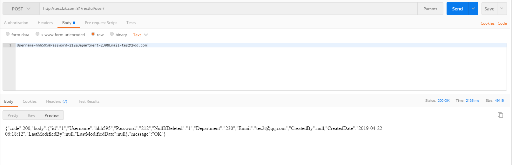
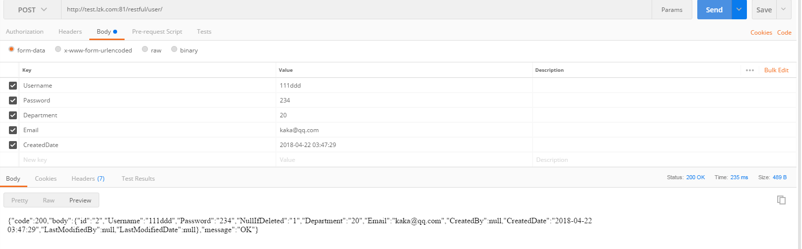
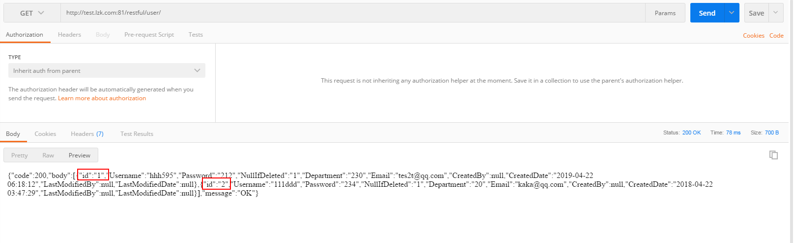
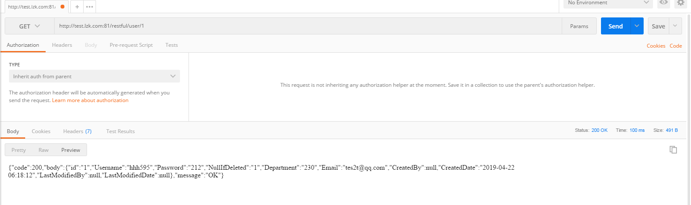
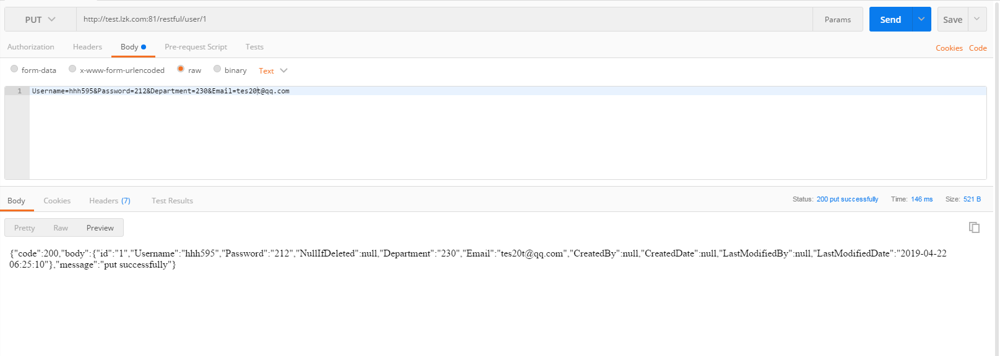
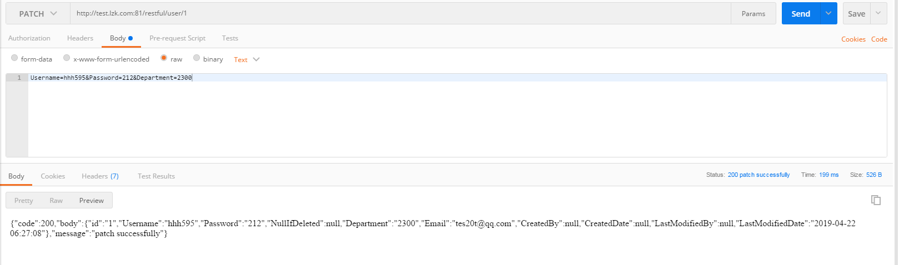
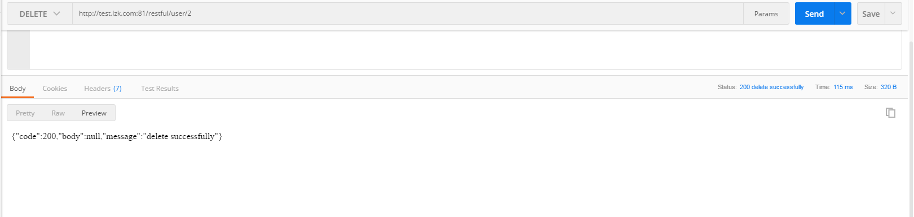

# Php Simple Restful API


**[SimpleRestful](https://github.com/2NanA/SimpleRestful)** Quick understanding of restful style APIs for beginner PHP programmers。


## install & configuration 

1. This program runs on Apache 2.4
   
    ```
    Rewiterule refer to \.htaccess
    ```

2. Configure your database connection
       
    ```
    refer to dbconfig.ini
    ```

2. Initialization data need mysql5.1+
   
    ```
    exec init.sql 
    ```

## How to use 
- post
    <div>
    
    </div>
    <div>
    
    </div>

- get
    <div>
    
    </div>
    <div>
    
    </div>

- put
    <div>
    
    </div>

- patch
    <div>
    
    </div>

- delete
    <div>
    
    </div>

- or you can send request by php curl ** refer to [curl_test.php](test/curl_test.php). The example urls refer to [index.php](index.php)

## Help
   * Email 494243364@qq.com